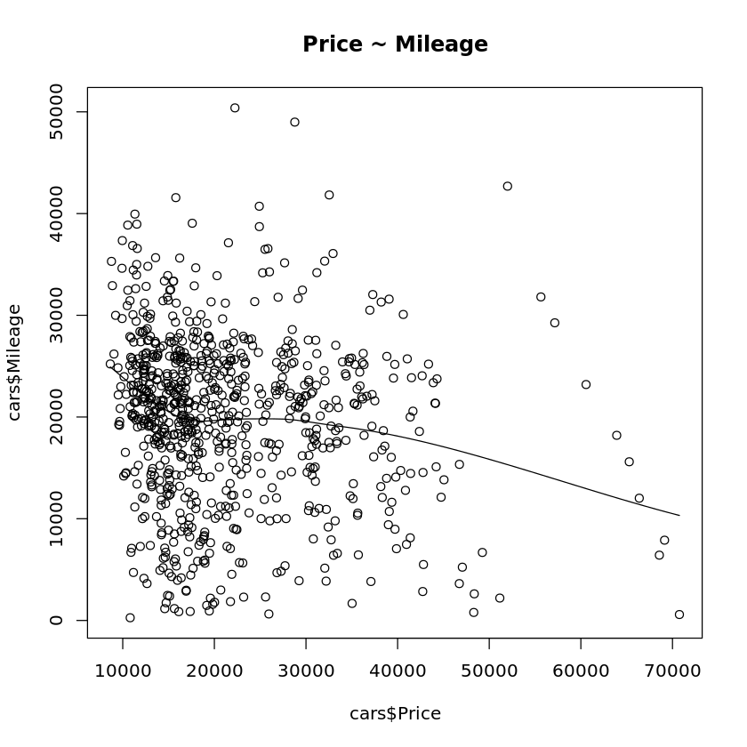
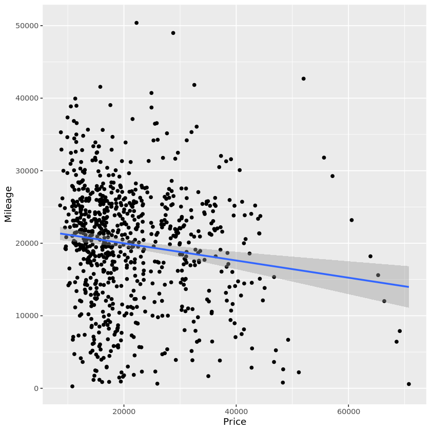
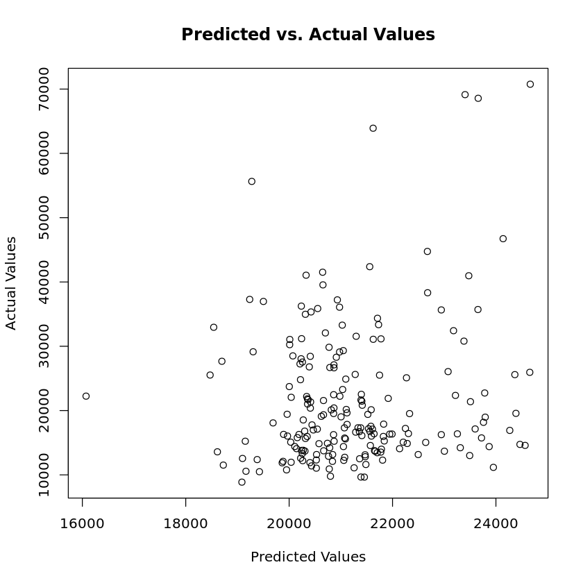

```R
install.packages('caret')
```

    Installing package into ‘/srv/rlibs’
    (as ‘lib’ is unspecified)
    


```R
data(cars, package='caret')
str(cars)
```

    'data.frame':	804 obs. of  18 variables:
     $ Price      : num  22661 21725 29143 30732 33359 ...
     $ Mileage    : int  20105 13457 31655 22479 17590 23635 17381 27558 25049 17319 ...
     $ Cylinder   : int  6 6 4 4 4 4 4 4 4 4 ...
     $ Doors      : int  4 2 2 2 2 2 2 2 2 4 ...
     $ Cruise     : int  1 1 1 1 1 1 1 1 1 1 ...
     $ Sound      : int  0 1 1 0 1 0 1 0 0 0 ...
     $ Leather    : int  0 0 1 0 1 0 1 1 0 1 ...
     $ Buick      : int  1 0 0 0 0 0 0 0 0 0 ...
     $ Cadillac   : int  0 0 0 0 0 0 0 0 0 0 ...
     $ Chevy      : int  0 1 0 0 0 0 0 0 0 0 ...
     $ Pontiac    : int  0 0 0 0 0 0 0 0 0 0 ...
     $ Saab       : int  0 0 1 1 1 1 1 1 1 1 ...
     $ Saturn     : int  0 0 0 0 0 0 0 0 0 0 ...
     $ convertible: int  0 0 1 1 1 1 1 1 1 0 ...
     $ coupe      : int  0 1 0 0 0 0 0 0 0 0 ...
     $ hatchback  : int  0 0 0 0 0 0 0 0 0 0 ...
     $ sedan      : int  1 0 0 0 0 0 0 0 0 1 ...
     $ wagon      : int  0 0 0 0 0 0 0 0 0 0 ...


```R
cars
```


<table class="dataframe">
<caption>A data.frame: 804 × 18</caption>
<thead>
	<tr><th scope=col>Price</th><th scope=col>Mileage</th><th scope=col>Cylinder</th><th scope=col>Doors</th><th scope=col>Cruise</th><th scope=col>Sound</th><th scope=col>Leather</th><th scope=col>Buick</th><th scope=col>Cadillac</th><th scope=col>Chevy</th><th scope=col>Pontiac</th><th scope=col>Saab</th><th scope=col>Saturn</th><th scope=col>convertible</th><th scope=col>coupe</th><th scope=col>hatchback</th><th scope=col>sedan</th><th scope=col>wagon</th></tr>
	<tr><th scope=col>&lt;dbl&gt;</th><th scope=col>&lt;int&gt;</th><th scope=col>&lt;int&gt;</th><th scope=col>&lt;int&gt;</th><th scope=col>&lt;int&gt;</th><th scope=col>&lt;int&gt;</th><th scope=col>&lt;int&gt;</th><th scope=col>&lt;int&gt;</th><th scope=col>&lt;int&gt;</th><th scope=col>&lt;int&gt;</th><th scope=col>&lt;int&gt;</th><th scope=col>&lt;int&gt;</th><th scope=col>&lt;int&gt;</th><th scope=col>&lt;int&gt;</th><th scope=col>&lt;int&gt;</th><th scope=col>&lt;int&gt;</th><th scope=col>&lt;int&gt;</th><th scope=col>&lt;int&gt;</th></tr>
</thead>
<tbody>
	<tr><td>22661.05</td><td>20105</td><td>6</td><td>4</td><td>1</td><td>0</td><td>0</td><td>1</td><td>0</td><td>0</td><td>0</td><td>0</td><td>0</td><td>0</td><td>0</td><td>0</td><td>1</td><td>0</td></tr>
	<tr><td>21725.01</td><td>13457</td><td>6</td><td>2</td><td>1</td><td>1</td><td>0</td><td>0</td><td>0</td><td>1</td><td>0</td><td>0</td><td>0</td><td>0</td><td>1</td><td>0</td><td>0</td><td>0</td></tr>
	<tr><td>29142.71</td><td>31655</td><td>4</td><td>2</td><td>1</td><td>1</td><td>1</td><td>0</td><td>0</td><td>0</td><td>0</td><td>1</td><td>0</td><td>1</td><td>0</td><td>0</td><td>0</td><td>0</td></tr>
	<tr><td>30731.94</td><td>22479</td><td>4</td><td>2</td><td>1</td><td>0</td><td>0</td><td>0</td><td>0</td><td>0</td><td>0</td><td>1</td><td>0</td><td>1</td><td>0</td><td>0</td><td>0</td><td>0</td></tr>
	<tr><td>33358.77</td><td>17590</td><td>4</td><td>2</td><td>1</td><td>1</td><td>1</td><td>0</td><td>0</td><td>0</td><td>0</td><td>1</td><td>0</td><td>1</td><td>0</td><td>0</td><td>0</td><td>0</td></tr>
	<tr><td>30315.17</td><td>23635</td><td>4</td><td>2</td><td>1</td><td>0</td><td>0</td><td>0</td><td>0</td><td>0</td><td>0</td><td>1</td><td>0</td><td>1</td><td>0</td><td>0</td><td>0</td><td>0</td></tr>
	<tr><td>33381.82</td><td>17381</td><td>4</td><td>2</td><td>1</td><td>1</td><td>1</td><td>0</td><td>0</td><td>0</td><td>0</td><td>1</td><td>0</td><td>1</td><td>0</td><td>0</td><td>0</td><td>0</td></tr>
	<tr><td>30251.02</td><td>27558</td><td>4</td><td>2</td><td>1</td><td>0</td><td>1</td><td>0</td><td>0</td><td>0</td><td>0</td><td>1</td><td>0</td><td>1</td><td>0</td><td>0</td><td>0</td><td>0</td></tr>
	<tr><td>30166.85</td><td>25049</td><td>4</td><td>2</td><td>1</td><td>0</td><td>0</td><td>0</td><td>0</td><td>0</td><td>0</td><td>1</td><td>0</td><td>1</td><td>0</td><td>0</td><td>0</td><td>0</td></tr>
	<tr><td>27060.14</td><td>17319</td><td>4</td><td>4</td><td>1</td><td>0</td><td>1</td><td>0</td><td>0</td><td>0</td><td>0</td><td>1</td><td>0</td><td>0</td><td>0</td><td>0</td><td>1</td><td>0</td></tr>
	<tr><td>26841.08</td><td>10003</td><td>4</td><td>4</td><td>1</td><td>1</td><td>0</td><td>0</td><td>0</td><td>0</td><td>0</td><td>1</td><td>0</td><td>0</td><td>0</td><td>0</td><td>1</td><td>0</td></tr>
	<tr><td>25790.51</td><td>21160</td><td>4</td><td>4</td><td>1</td><td>1</td><td>1</td><td>0</td><td>0</td><td>0</td><td>0</td><td>1</td><td>0</td><td>0</td><td>0</td><td>0</td><td>1</td><td>0</td></tr>
	<tr><td>25148.38</td><td>22272</td><td>4</td><td>4</td><td>1</td><td>1</td><td>1</td><td>0</td><td>0</td><td>0</td><td>0</td><td>1</td><td>0</td><td>0</td><td>0</td><td>0</td><td>1</td><td>0</td></tr>
	<tr><td>24173.53</td><td>27015</td><td>4</td><td>4</td><td>1</td><td>0</td><td>0</td><td>0</td><td>0</td><td>0</td><td>0</td><td>1</td><td>0</td><td>0</td><td>0</td><td>0</td><td>1</td><td>0</td></tr>
	<tr><td>24852.50</td><td>22814</td><td>4</td><td>4</td><td>1</td><td>1</td><td>1</td><td>0</td><td>0</td><td>0</td><td>0</td><td>1</td><td>0</td><td>0</td><td>0</td><td>0</td><td>1</td><td>0</td></tr>
	<tr><td>27825.95</td><td>10014</td><td>4</td><td>4</td><td>1</td><td>0</td><td>1</td><td>0</td><td>0</td><td>0</td><td>0</td><td>1</td><td>0</td><td>0</td><td>0</td><td>0</td><td>1</td><td>0</td></tr>
	<tr><td>26698.08</td><td>23055</td><td>4</td><td>4</td><td>1</td><td>1</td><td>1</td><td>0</td><td>0</td><td>0</td><td>0</td><td>1</td><td>0</td><td>0</td><td>0</td><td>0</td><td>1</td><td>0</td></tr>
	<tr><td>28185.78</td><td>19854</td><td>4</td><td>4</td><td>1</td><td>1</td><td>1</td><td>0</td><td>0</td><td>0</td><td>0</td><td>1</td><td>0</td><td>0</td><td>0</td><td>0</td><td>1</td><td>0</td></tr>
	<tr><td>27241.44</td><td>23204</td><td>4</td><td>4</td><td>1</td><td>1</td><td>1</td><td>0</td><td>0</td><td>0</td><td>0</td><td>1</td><td>0</td><td>0</td><td>0</td><td>0</td><td>1</td><td>0</td></tr>
	<tr><td>30800.66</td><td> 8017</td><td>4</td><td>4</td><td>1</td><td>0</td><td>1</td><td>0</td><td>0</td><td>0</td><td>0</td><td>1</td><td>0</td><td>0</td><td>0</td><td>0</td><td>1</td><td>0</td></tr>
	<tr><td>28416.46</td><td>14613</td><td>4</td><td>4</td><td>1</td><td>0</td><td>1</td><td>0</td><td>0</td><td>0</td><td>0</td><td>1</td><td>0</td><td>0</td><td>0</td><td>0</td><td>1</td><td>0</td></tr>
	<tr><td>26653.24</td><td>22590</td><td>4</td><td>4</td><td>1</td><td>1</td><td>1</td><td>0</td><td>0</td><td>0</td><td>0</td><td>1</td><td>0</td><td>0</td><td>0</td><td>0</td><td>1</td><td>0</td></tr>
	<tr><td>27610.86</td><td>22881</td><td>4</td><td>4</td><td>1</td><td>1</td><td>1</td><td>0</td><td>0</td><td>0</td><td>0</td><td>1</td><td>0</td><td>0</td><td>0</td><td>0</td><td>1</td><td>0</td></tr>
	<tr><td>27788.81</td><td>26786</td><td>4</td><td>4</td><td>1</td><td>0</td><td>1</td><td>0</td><td>0</td><td>0</td><td>0</td><td>1</td><td>0</td><td>0</td><td>0</td><td>0</td><td>0</td><td>1</td></tr>
	<tr><td>29986.79</td><td>18464</td><td>4</td><td>4</td><td>1</td><td>0</td><td>1</td><td>0</td><td>0</td><td>0</td><td>0</td><td>1</td><td>0</td><td>0</td><td>0</td><td>0</td><td>0</td><td>1</td></tr>
	<tr><td>29197.79</td><td>20907</td><td>4</td><td>4</td><td>1</td><td>0</td><td>1</td><td>0</td><td>0</td><td>0</td><td>0</td><td>1</td><td>0</td><td>0</td><td>0</td><td>0</td><td>0</td><td>1</td></tr>
	<tr><td>29908.18</td><td>19830</td><td>4</td><td>4</td><td>1</td><td>1</td><td>1</td><td>0</td><td>0</td><td>0</td><td>0</td><td>1</td><td>0</td><td>0</td><td>0</td><td>0</td><td>0</td><td>1</td></tr>
	<tr><td>29481.53</td><td>21822</td><td>4</td><td>4</td><td>1</td><td>1</td><td>1</td><td>0</td><td>0</td><td>0</td><td>0</td><td>1</td><td>0</td><td>0</td><td>0</td><td>0</td><td>0</td><td>1</td></tr>
	<tr><td>26792.30</td><td>25357</td><td>4</td><td>4</td><td>1</td><td>0</td><td>1</td><td>0</td><td>0</td><td>0</td><td>0</td><td>1</td><td>0</td><td>0</td><td>0</td><td>0</td><td>0</td><td>1</td></tr>
	<tr><td>29321.08</td><td>21545</td><td>4</td><td>4</td><td>1</td><td>0</td><td>1</td><td>0</td><td>0</td><td>0</td><td>0</td><td>1</td><td>0</td><td>0</td><td>0</td><td>0</td><td>0</td><td>1</td></tr>
	<tr><td>⋮</td><td>⋮</td><td>⋮</td><td>⋮</td><td>⋮</td><td>⋮</td><td>⋮</td><td>⋮</td><td>⋮</td><td>⋮</td><td>⋮</td><td>⋮</td><td>⋮</td><td>⋮</td><td>⋮</td><td>⋮</td><td>⋮</td><td>⋮</td></tr>
	<tr><td>15967.25</td><td>25598</td><td>6</td><td>4</td><td>1</td><td>0</td><td>0</td><td>0</td><td>0</td><td>0</td><td>1</td><td>0</td><td>0</td><td>0</td><td>0</td><td>0</td><td>1</td><td>0</td></tr>
	<tr><td>12293.06</td><td>17139</td><td>4</td><td>4</td><td>1</td><td>0</td><td>1</td><td>0</td><td>0</td><td>0</td><td>0</td><td>0</td><td>1</td><td>0</td><td>0</td><td>0</td><td>1</td><td>0</td></tr>
	<tr><td>11504.82</td><td>33962</td><td>4</td><td>4</td><td>0</td><td>0</td><td>0</td><td>0</td><td>0</td><td>0</td><td>0</td><td>0</td><td>1</td><td>0</td><td>0</td><td>0</td><td>1</td><td>0</td></tr>
	<tr><td>11873.53</td><td>28398</td><td>4</td><td>4</td><td>0</td><td>0</td><td>0</td><td>0</td><td>0</td><td>0</td><td>0</td><td>0</td><td>1</td><td>0</td><td>0</td><td>0</td><td>1</td><td>0</td></tr>
	<tr><td>14568.00</td><td>18511</td><td>4</td><td>4</td><td>0</td><td>1</td><td>1</td><td>0</td><td>0</td><td>0</td><td>0</td><td>0</td><td>1</td><td>0</td><td>0</td><td>0</td><td>1</td><td>0</td></tr>
	<tr><td>13998.13</td><td>18257</td><td>4</td><td>4</td><td>0</td><td>1</td><td>1</td><td>0</td><td>0</td><td>0</td><td>0</td><td>0</td><td>1</td><td>0</td><td>0</td><td>0</td><td>1</td><td>0</td></tr>
	<tr><td>13258.37</td><td>14938</td><td>4</td><td>4</td><td>1</td><td>1</td><td>1</td><td>0</td><td>0</td><td>0</td><td>0</td><td>0</td><td>1</td><td>0</td><td>0</td><td>0</td><td>1</td><td>0</td></tr>
	<tr><td>11413.53</td><td>32619</td><td>4</td><td>4</td><td>1</td><td>0</td><td>1</td><td>0</td><td>0</td><td>0</td><td>0</td><td>0</td><td>1</td><td>0</td><td>0</td><td>0</td><td>1</td><td>0</td></tr>
	<tr><td>15194.98</td><td>12412</td><td>4</td><td>4</td><td>0</td><td>0</td><td>1</td><td>0</td><td>0</td><td>0</td><td>0</td><td>0</td><td>1</td><td>0</td><td>0</td><td>0</td><td>1</td><td>0</td></tr>
	<tr><td>19689.74</td><td>27077</td><td>6</td><td>4</td><td>1</td><td>1</td><td>0</td><td>0</td><td>0</td><td>0</td><td>1</td><td>0</td><td>0</td><td>0</td><td>0</td><td>0</td><td>1</td><td>0</td></tr>
	<tr><td>22460.53</td><td> 8928</td><td>6</td><td>4</td><td>1</td><td>0</td><td>1</td><td>0</td><td>0</td><td>0</td><td>1</td><td>0</td><td>0</td><td>0</td><td>0</td><td>0</td><td>1</td><td>0</td></tr>
	<tr><td>19338.38</td><td>27966</td><td>6</td><td>4</td><td>1</td><td>0</td><td>1</td><td>0</td><td>0</td><td>0</td><td>1</td><td>0</td><td>0</td><td>0</td><td>0</td><td>0</td><td>1</td><td>0</td></tr>
	<tr><td>26831.19</td><td> 4695</td><td>6</td><td>4</td><td>1</td><td>1</td><td>0</td><td>1</td><td>0</td><td>0</td><td>0</td><td>0</td><td>0</td><td>0</td><td>0</td><td>0</td><td>1</td><td>0</td></tr>
	<tr><td>25508.21</td><td>17480</td><td>6</td><td>4</td><td>1</td><td>1</td><td>0</td><td>1</td><td>0</td><td>0</td><td>0</td><td>0</td><td>0</td><td>0</td><td>0</td><td>0</td><td>1</td><td>0</td></tr>
	<tr><td>23406.69</td><td>25387</td><td>6</td><td>4</td><td>1</td><td>0</td><td>1</td><td>1</td><td>0</td><td>0</td><td>0</td><td>0</td><td>0</td><td>0</td><td>0</td><td>0</td><td>1</td><td>0</td></tr>
	<tr><td>17214.33</td><td>12610</td><td>4</td><td>4</td><td>1</td><td>1</td><td>1</td><td>0</td><td>0</td><td>0</td><td>1</td><td>0</td><td>0</td><td>0</td><td>0</td><td>0</td><td>0</td><td>1</td></tr>
	<tr><td>14853.20</td><td>24270</td><td>4</td><td>4</td><td>0</td><td>0</td><td>0</td><td>0</td><td>0</td><td>0</td><td>1</td><td>0</td><td>0</td><td>0</td><td>0</td><td>0</td><td>0</td><td>1</td></tr>
	<tr><td>14398.92</td><td>21688</td><td>4</td><td>4</td><td>0</td><td>0</td><td>0</td><td>0</td><td>0</td><td>0</td><td>1</td><td>0</td><td>0</td><td>0</td><td>0</td><td>0</td><td>0</td><td>1</td></tr>
	<tr><td>20221.81</td><td>26223</td><td>6</td><td>2</td><td>1</td><td>1</td><td>1</td><td>0</td><td>0</td><td>1</td><td>0</td><td>0</td><td>0</td><td>0</td><td>1</td><td>0</td><td>0</td><td>0</td></tr>
	<tr><td>20382.15</td><td>25240</td><td>6</td><td>2</td><td>1</td><td>1</td><td>1</td><td>0</td><td>0</td><td>1</td><td>0</td><td>0</td><td>0</td><td>0</td><td>1</td><td>0</td><td>0</td><td>0</td></tr>
	<tr><td>22113.63</td><td>21992</td><td>6</td><td>2</td><td>1</td><td>1</td><td>0</td><td>0</td><td>0</td><td>1</td><td>0</td><td>0</td><td>0</td><td>0</td><td>1</td><td>0</td><td>0</td><td>0</td></tr>
	<tr><td>25097.47</td><td>14461</td><td>6</td><td>4</td><td>1</td><td>1</td><td>1</td><td>0</td><td>0</td><td>1</td><td>0</td><td>0</td><td>0</td><td>0</td><td>0</td><td>0</td><td>1</td><td>0</td></tr>
	<tr><td>22120.76</td><td>28242</td><td>6</td><td>4</td><td>1</td><td>1</td><td>1</td><td>0</td><td>0</td><td>1</td><td>0</td><td>0</td><td>0</td><td>0</td><td>0</td><td>0</td><td>1</td><td>0</td></tr>
	<tr><td>23345.33</td><td>22964</td><td>6</td><td>4</td><td>1</td><td>1</td><td>1</td><td>0</td><td>0</td><td>1</td><td>0</td><td>0</td><td>0</td><td>0</td><td>0</td><td>0</td><td>1</td><td>0</td></tr>
	<tr><td>11167.86</td><td> 4716</td><td>4</td><td>4</td><td>1</td><td>1</td><td>0</td><td>0</td><td>0</td><td>1</td><td>0</td><td>0</td><td>0</td><td>0</td><td>0</td><td>1</td><td>0</td><td>0</td></tr>
	<tr><td>10813.34</td><td>  266</td><td>4</td><td>4</td><td>1</td><td>0</td><td>1</td><td>0</td><td>0</td><td>1</td><td>0</td><td>0</td><td>0</td><td>0</td><td>0</td><td>1</td><td>0</td><td>0</td></tr>
	<tr><td> 9720.98</td><td>20836</td><td>4</td><td>4</td><td>1</td><td>1</td><td>0</td><td>0</td><td>0</td><td>1</td><td>0</td><td>0</td><td>0</td><td>0</td><td>0</td><td>1</td><td>0</td><td>0</td></tr>
	<tr><td> 9482.22</td><td>24842</td><td>4</td><td>4</td><td>1</td><td>0</td><td>0</td><td>0</td><td>0</td><td>1</td><td>0</td><td>0</td><td>0</td><td>0</td><td>0</td><td>0</td><td>1</td><td>0</td></tr>
	<tr><td> 9563.79</td><td>19273</td><td>4</td><td>4</td><td>1</td><td>1</td><td>0</td><td>0</td><td>0</td><td>1</td><td>0</td><td>0</td><td>0</td><td>0</td><td>0</td><td>0</td><td>1</td><td>0</td></tr>
	<tr><td> 9665.85</td><td>19565</td><td>4</td><td>4</td><td>0</td><td>1</td><td>1</td><td>0</td><td>0</td><td>1</td><td>0</td><td>0</td><td>0</td><td>0</td><td>0</td><td>0</td><td>1</td><td>0</td></tr>
</tbody>
</table>


```R
scatter.smooth(x=cars$Price, y=cars$Mileage, main="Price ~ Mileage")
```


    

    


```R
pearson = cor(cars$Price, cars$Mileage, method = "pearson")
print(pearson)
```

    [1] -0.1430505


```R
spearman = cor(cars$Price, cars$Mileage, method = "spearman")
print(spearman)
```

    [1] -0.1490572


```R
linearModel <- lm(Price ~ Mileage, data=cars)
print(linearModel)
```

    
    Call:
    lm(formula = Price ~ Mileage, data = cars)
    
    Coefficients:
    (Intercept)      Mileage  
     24764.5590      -0.1725  
    


```R
summary(linearModel)
```


    
    Call:
    lm(formula = Price ~ Mileage, data = cars)
    
    Residuals:
       Min     1Q Median     3Q    Max 
    -13905  -7254  -3520   5188  46091 
    
    Coefficients:
                  Estimate Std. Error t value Pr(>|t|)    
    (Intercept)  2.476e+04  9.044e+02  27.383  < 2e-16 ***
    Mileage     -1.725e-01  4.215e-02  -4.093 4.68e-05 ***
    ---
    Signif. codes:  0 ‘***’ 0.001 ‘**’ 0.01 ‘*’ 0.05 ‘.’ 0.1 ‘ ’ 1
    
    Residual standard error: 9789 on 802 degrees of freedom
    Multiple R-squared:  0.02046,	Adjusted R-squared:  0.01924 
    F-statistic: 16.75 on 1 and 802 DF,  p-value: 4.685e-05


```R
require(ggplot2)
ggplot(cars,aes(y=Mileage,x=Price))+geom_point()+geom_smooth(method="lm")
```

    `geom_smooth()` using formula 'y ~ x'
    


    

    


```R
#find sse
sse <- sum((fitted(linearModel) - cars$Price)^2)
sse
```


76855792462.7467


```R
#find ssr
ssr <- sum((fitted(linearModel) - mean(cars$Price))^2)
ssr
```


1605590371.58251


```R
#find sst
sst <- ssr + sse
sst
```


78461382834.3293


```R
set.seed(100)  
trainingRowIndex <- sample(1:nrow(cars), 0.75*nrow(cars)) 
trainingData <- cars[trainingRowIndex, ]  
testData  <- cars[-trainingRowIndex, ]  
```


```R
pricePred <- predict(linearModel, testData)
```


```R
actuals_preds <- data.frame(cbind(actuals=testData$Price, predicteds=pricePred))  
correlation_accuracy <- cor(actuals_preds)
```


```R
plot(x=pricePred, y=testData$Price,
     xlab='Predicted Values',
     ylab='Actual Values',
     main='Predicted vs. Actual Values')
```


    

    


```R
path <- "./binary.csv"

binary <- read.csv(path)
```


```R
install.packages("caTools")
install.packages("InformationValue")
install.packages("ISLR")
```

    Installing package into ‘/srv/rlibs’
    (as ‘lib’ is unspecified)
    
    Installing package into ‘/srv/rlibs’
    (as ‘lib’ is unspecified)
    
    Installing package into ‘/srv/rlibs’
    (as ‘lib’ is unspecified)
    


```R
library(caTools)
library(InformationValue)
library(ISLR)
   
split <- sample.split(binary, SplitRatio = 0.8)
   
train_reg <- subset(binary, split == "TRUE")
test_reg <- subset(binary, split == "FALSE")
   
# Training model
logistic_model <- glm(gre ~ rank, 
                      data = train_reg, 
                      )
logistic_model
   
# Summary
summary(logistic_model)
```


    
    Call:  glm(formula = gre ~ rank, data = train_reg)
    
    Coefficients:
    (Intercept)         rank  
        610.031       -9.225  
    
    Degrees of Freedom: 299 Total (i.e. Null);  298 Residual
    Null Deviance:	    3789000 
    Residual Deviance: 3766000 	AIC: 3689


    
    Call:
    glm(formula = gre ~ rank, data = train_reg)
    
    Deviance Residuals: 
        Min       1Q   Median       3Q      Max  
    -362.36   -71.58     3.03    77.64   226.87  
    
    Coefficients:
                Estimate Std. Error t value Pr(>|t|)    
    (Intercept)  610.031     18.362  33.222   <2e-16 ***
    rank          -9.225      6.880  -1.341    0.181    
    ---
    Signif. codes:  0 ‘***’ 0.001 ‘**’ 0.01 ‘*’ 0.05 ‘.’ 0.1 ‘ ’ 1
    
    (Dispersion parameter for gaussian family taken to be 12638.19)
    
        Null deviance: 3788900  on 299  degrees of freedom
    Residual deviance: 3766179  on 298  degrees of freedom
    AIC: 3688.7
    
    Number of Fisher Scoring iterations: 2


```R
predict_reg <- predict(logistic_model, 
                       test_reg, type = "response")
   
predict_reg <- ifelse(predict_reg >0.5, 1, 0)
```


```R
confusionMatrix(test_reg$gre, predict_reg)
```


<table class="dataframe">
<caption>A data.frame: 1 × 23</caption>
<thead>
	<tr><th></th><th scope=col>360</th><th scope=col>380</th><th scope=col>400</th><th scope=col>420</th><th scope=col>440</th><th scope=col>460</th><th scope=col>480</th><th scope=col>500</th><th scope=col>520</th><th scope=col>540</th><th scope=col>⋯</th><th scope=col>620</th><th scope=col>640</th><th scope=col>660</th><th scope=col>680</th><th scope=col>700</th><th scope=col>720</th><th scope=col>740</th><th scope=col>760</th><th scope=col>780</th><th scope=col>800</th></tr>
	<tr><th></th><th scope=col>&lt;int&gt;</th><th scope=col>&lt;int&gt;</th><th scope=col>&lt;int&gt;</th><th scope=col>&lt;int&gt;</th><th scope=col>&lt;int&gt;</th><th scope=col>&lt;int&gt;</th><th scope=col>&lt;int&gt;</th><th scope=col>&lt;int&gt;</th><th scope=col>&lt;int&gt;</th><th scope=col>&lt;int&gt;</th><th scope=col>⋯</th><th scope=col>&lt;int&gt;</th><th scope=col>&lt;int&gt;</th><th scope=col>&lt;int&gt;</th><th scope=col>&lt;int&gt;</th><th scope=col>&lt;int&gt;</th><th scope=col>&lt;int&gt;</th><th scope=col>&lt;int&gt;</th><th scope=col>&lt;int&gt;</th><th scope=col>&lt;int&gt;</th><th scope=col>&lt;int&gt;</th></tr>
</thead>
<tbody>
	<tr><th scope=row>1</th><td>2</td><td>4</td><td>2</td><td>3</td><td>2</td><td>6</td><td>6</td><td>6</td><td>5</td><td>4</td><td>⋯</td><td>7</td><td>4</td><td>5</td><td>3</td><td>7</td><td>3</td><td>2</td><td>1</td><td>2</td><td>10</td></tr>
</tbody>
</table>


```R

```
